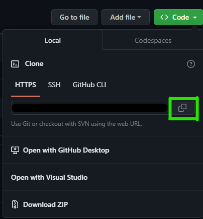
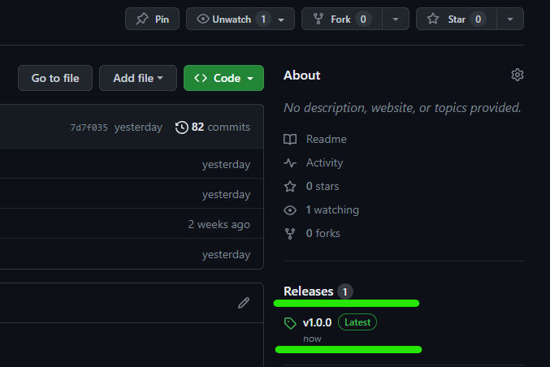
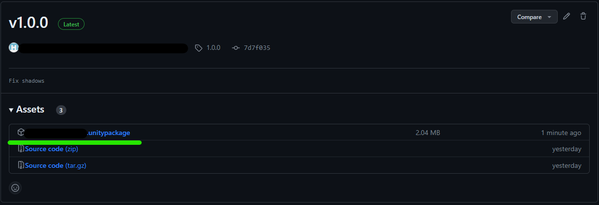
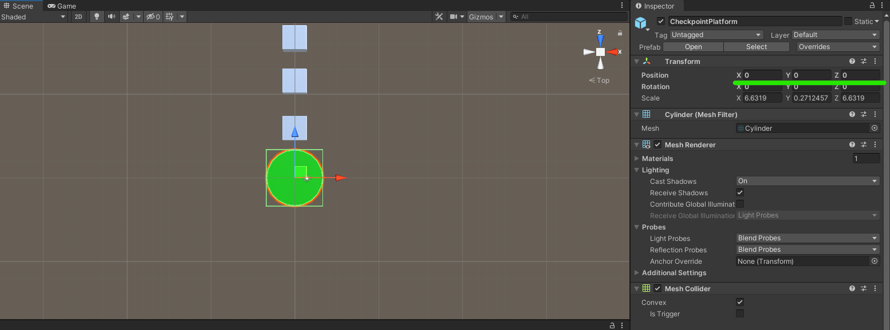
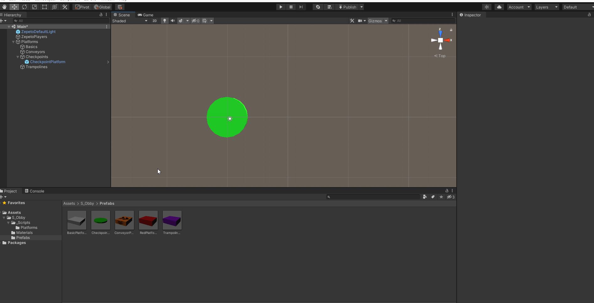

# Simplified Obby Template

## 📢 About

Nice to meet you Creators! 👋 Welcome to Obby guide!  

With Obby you can create amazing worlds to play with your friends!  

Now, are you ready to start?  

## Overview

A simplified version of the Obby template, it will show a few things to create simple levels and worlds with this mechanic having 3 types of platforms, moving platforms, teleporters and red platforms that will make the player lose.
  

  

## ❓ How to create with Obby Template

:wrench: Installation and settings

- If you haven't install the Zepeto World you can check how to do it <a href="https://docs.zepeto.me/studio/reference/installation_and_settings">Here!</a>

- Once you have installed Zepeto, you have to pull this repository and you can do it in 3 ways
  - [Cloning it](#cloning-the-project)
  - [Downloading it](#downloading-the-project)
  - [By Unitypackage](#getting-it-from-the-releases-section)

### Cloning the project

First we go to the [Code] button and click it.

 </img> 

Then click on the icon to copy the link of the repository (make sure that you are on the https tab) or copy it manually.

 </img> 

Once you have it, using your your preferred software (in this case we are using <a href="https://git-fork.com/" target="_blank"> Fork</a>) click on "File->Clone" or press "Ctrl + N" to clone.

 </img> 

Here we fill the URL tab and set the folder where you want to save it and press clone.

 </img> 

Once it clones the project you can open it from Unity Hub.  

### Downloading the project

Click on the same [Code] button but instead of clicking on the link, click on download zip

 </img> 

Then extract the files and open it with Unity.  

### Getting it from the releases section

Go to the releases section or click in the latest release.

 </img> 

Then click on the file ".unitypackage" and import it in a new project of Unity!

 </img> 

> 💡 Enjoy and start creating with the Template! :tada:
 

## ❓ FAQ

<h3>How to open the project</h3> 

Select the template folder and it will open the project.
 </img>

To open a Unity project for the first time, follow these steps:

1. Launch Unity Hub.
2. In Unity Hub, click on the "Projects" tab on the left side.
3. Click on Add: If your project is not already listed, click on the "Add" button to add your project to the list. Navigate to the folder where your Unity project is located and select the folder. Click "Open" to add the project to Unity Hub.
4. Select Project: Once your project is added to the list, click on it to select it.
5. Wait for Unity to Load: Unity will now open your project. This may take some time depending on the size of your project and your computer's performance.
6. Project Opened: Once Unity has finished loading, your project will be opened and ready for you to work on.

<h3>How to play</h3> 
 
1. Just open the scene [double click on the green underlined object].  
 </img>  
2. Press the play button:
 </img> 

  

## 🔨 Tools

<h3>How to create your first world</h3>
To create your first world you have to drag and drop the <a href="#prefabs">platform prefabs</a> to the world in one folder and start to move them as you want, it's very simple!
 </img>
  

<b>IMPORTANT!</b> The first platform has to be in the (0,0,0) position in the world so your player will spawn there.
 </img> 

Then you can build your world as you want with the platforms that you want!
 </img> 

<h3>Player Spawner</h3> 
 
This class only has the behaviour to create a zepeto character in the world.
 </img>  

<h3>Player controller</h3> 
 
This class handles the behaviour related to the player, has the respawn settings.
 </img>  

<h3>Platform prefabs</h3> 
 
You could find the platform prefabs on the folder "Prefabs" on the project.
 </img>  

Basic platform
 
- Just a basic platform with no behaviour where you can walk on.
 </img>  

Checkpoint platform
 
- The checkpoint platform has the behaviour to set it as the last checkpoint reached by the player, but it is no repeteable so if you try to go back to a previous checkpoint it will not set itself as the last checkpoint reached again.
 </img> 
It has this script attached.
 </img>  

Conveyor platform
 
- The conveyor push the player to his arrow direction (or in the Z forward axis) with certain force.
 </img> 
It has this script attached.
 </img>  

Red platform
 
- The red platform makes the player "lose" so the player respawns (or get teleported) in the last checkpoint reached.
 </img> 
It has this script attached.
 </img>  

Trampoline platform
 
- The trampoline platform makes the player jump automatically with a certain force when the player touches it. 
 </img> 
It has this script attached.
 </img>  

## :point_right: You can easily modify this:

<h3>Creating your first world in Unity:</h3>

1. Open Unity: Open the template.
2. Add Platforms to the Scene:  You could find the platform prefabs on the folder "Prefabs" on the project. Drag and drop the platform prefabs into the scene. Arrange them as you want your world to look.
 </img>  
3. The first platform has to be in the (0,0,0) position in the world so your player will spawn there.
4. Edit Platform Positions: Select the platforms in the scene and use the Move tool (shortcut key W) to adjust their positions. You can also rotate them using the Rotate tool (shortcut key E).
5. Add Details: Add other elements like obstacles, decorations, or characters to your world to make it more interesting and engaging.
6. Test Your World: Click the Play button at the top of the Unity editor to test your world. Make sure everything looks and behaves as expected.
7. Save Your Scene:  save the scene by going to "File" > "Save Scene" and give it a name.

<h3>UI Prefabs</h3>
You can edit every panel of each part of the game from their own prefab.
You can found them in the project folder.

  To modify UI prefabs in Unity, follow these steps:
1. Locate the UI prefab you want to modify. You can find prefabs in the project folder under the "Prefabs" directory or in a specific folder for UI elements.
2. Double-click on the UI prefab to open it in the Prefab Editor.
3. In the Prefab Editor, you can modify the UI elements as needed. This may include changing text, images, layouts, or adding/removing components.
4. Once you have made your modifications, save the prefab by clicking the "Apply" button in the Prefab Editor.
5. To apply the changes to instances of the prefab in your scene, select each instance and click the "Apply" button in the Inspector window.
6. Test your changes in Play mode to ensure they work as expected.
7. If you need to make further modifications, repeat the above steps.

